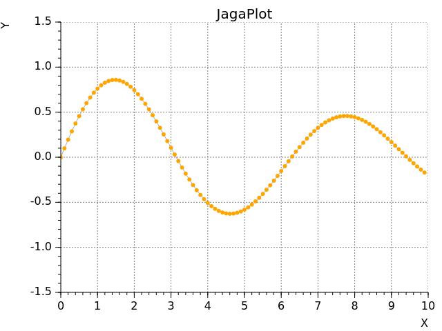

# jagaimo
JavaScript library for plotting and widgets

## Application Examples
#### SlowDash


[https://slowproj.github.io/slowdash/](https://slowproj.github.io/slowdash/)

## Usage

#### Plotting
Example from `test-plot-1.html`



```html
<div id="plotDiv" style="width:640px;height:480px"></div>

<script type="module">
    import { JG as $ } from './jagaimo/jagaimo.mjs';
    import { JGPlotWidget } from './jagaimo/jagaplot.mjs';

    window.addEventListener('DOMContentLoaded', function() {
        let plot = new JGPlotWidget($('#plotDiv'), { grid: true });
        let graph = {
            x: [], y: [],
            style: { 
                markerSize:3, markerColor:'orange', markerType:'circle',
                lineWidth: 1, lineColor: 'darkgray'
            },
        };
        
        const xmin = 0, xmax = 10, ymin = -1.5, ymax = 1.5;
        plot.setRange(xmin, xmax, ymin, ymax, { xlog: false, ylog: false });
        plot.setTitle('JagaPlot').setXTitle('X').setYTitle('Y');
        plot.addGraph(graph);

        // test-data
        for (let i = 0; i < 100; i++) {
            const xk = 10 * (i/100.0);
            const yk = Math.exp(-0.1*xk) * Math.sin(xk);
            graph.x.push(xk);
            graph.y.push(yk);
        }
        plot.update();
    });
</script>
```

For more examples, see `test-plot-?.html` files.
