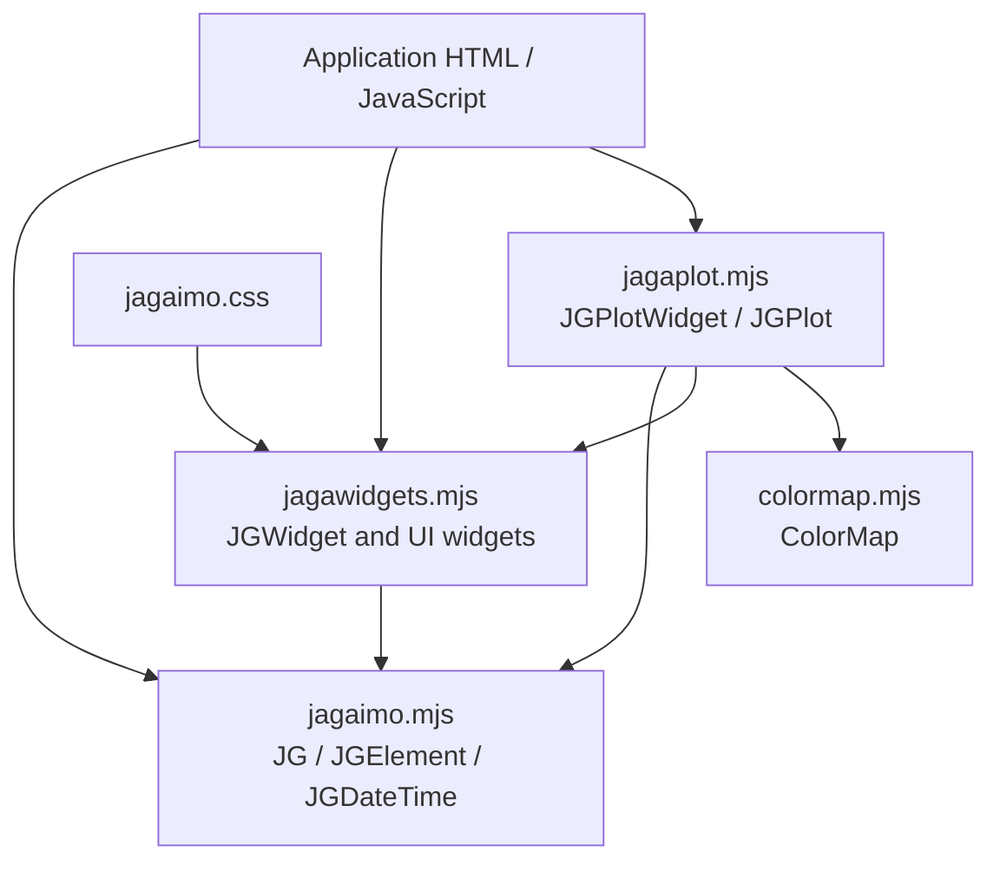

# Jagaimo Source Code Guide

## Scope

Jagaimo is a small browser-side JavaScript library for:

- constructing and manipulating DOM and SVG elements;
- rendering scientific-style plots as SVG;
- displaying simple reusable UI widgets; and
- mapping scalar values to colors for two-dimensional visualizations.

It uses standard ES modules and browser APIs. There is no framework, transpilation layer, or package build system in the repository.


## Repository Layout

| File | Purpose |
| --- | --- |
| `jagaimo.mjs` | Core DOM wrapper, utility functions, and date/time formatting. |
| `jagawidgets.mjs` | Generic browser widgets such as tabs, dialogs, popups, pull-downs, and indicators. |
| `jagaplot.mjs` | SVG plotting engine and interactive plot widget. |
| `colormap.mjs` | Color palettes and numeric-to-color mapping. |
| `jagaimo.css` | Styling for widget classes. |
| `docs/README.md` | Introductory documentation and basic plotting example. |
| `docs/test-plot-1.html` | Minimal graph example using `JGPlotWidget`. |
| `docs/test-plot-2.html` | Interactive and multi-feature plot demonstration. |
| `docs/test-plot-3.html` | Direct `JGPlot` example for embedding multiple plots in one SVG. |
| `docs/jagaimo` | Symlink used by the examples to reference the source directory. |

## Architecture



The library is layered:

1. `jagaimo.mjs` provides a compact jQuery-like wrapper named `JG`, usually
   imported as `$`.
2. `jagawidgets.mjs` builds general UI controls on top of that wrapper.
3. `jagaplot.mjs` uses both the core wrapper and widget base class to generate
   SVG plots and interactions.
4. `colormap.mjs` supplies color scales used when plotting two-dimensional
   histograms.

## Core Module: `jagaimo.mjs`

### `JGElement`

`JGElement` is a wrapper around one or more DOM nodes. The factory function
`JG()` constructs it:

```js
import { JG as $ } from './jagaimo.mjs';

const container = $('#plot');
const svgGroup = $('<g>', 'svg');
```

The constructor recognizes three common input forms:

| Input | Result |
| --- | --- |
| CSS selector string, such as `'#plot'` | Wraps every matching DOM node. |
| Element-creation string, such as `'<div>'` | Creates an HTML element. |
| Element-creation string with `'svg'` namespace | Creates an SVG element. |

Important method groups are:

| Category | Methods |
| --- | --- |
| Traversal | `find()`, `closest()`, `parent()`, `next()`, `at()`, `get()` |
| Tree changes | `append()`, `appendTo()`, `prepend()`, `remove()`, `empty()` |
| Content and values | `html()`, `text()`, `val()`, `selected()`, `checked()`, `enabled()` |
| Attributes and appearance | `attr()`, `data()`, `css()`, `addClass()`, `removeClass()` |
| Events and visibility | `bind()`, `unbind()`, `click()`, `show()`, `hide()`, `focus()` |
| Geometry | `boundingClientWidth()`, `boundingClientHeight()`, `pageX()`, `pageY()` |

The API is chainable for mutations:

```js
$('<div>')
    .addClass('message')
    .text('Ready')
    .appendTo($('#panel'));
```

`val()` handles common input types specially:

- checkbox and radio controls return a selected value or `false`;
- number and range controls return `valueAsNumber`;
- color controls accept `rgb(...)` values when setting a value; and
- select controls read and select option values.

### Utility Functions

The factory function also carries utilities as static properties:

| Utility | Description |
| --- | --- |
| `JG.sanitize()` | Escapes `&`, `<`, and `>` for safe text-like HTML content. |
| `JG.sanitizeWeakly()` | Escapes angle brackets while preserving ampersands. |
| `JG.extend()` | Merges objects, optionally recursively with `true` as the first argument. |
| `JG.sprintf()` | Formats numbers and strings with a small `printf`-like syntax. |
| `JG.JSON_stringify()` | Pretty-prints nested data structures. |
| `JG.time()` | Returns the current Unix time in seconds. |
| `JG.formatDuration()` | Formats a duration with day/hour/minute/second placeholders. |
| `JG.percentileOf()` | Determines a central range after filtering numeric values. |
| `JG.hsv2rgb()` | Converts HSV values to RGB components. |

### `JGDateTime`

`JGDateTime` wraps Unix timestamps and supplies `strftime`-style display:

```js
const label = new JGDateTime(timestamp).asString('%Y-%m-%d %H:%M:%S');
const utcLabel = new JGDateTime(timestamp).asUTCString('%Y-%m-%d %H:%M:%S');
```

This functionality is reused by plot axes when an X axis represents time.

## Widget Module: `jagawidgets.mjs`

### Widget Registration

`JGWidget` is the common base class. It attaches a widget index to its DOM
element, so the implementation can recover the JavaScript object associated
with a displayed widget. The module uses this lookup when global events must
close active popup controls.

### Available Widgets

| Class | Responsibility |
| --- | --- |
| `JGTabWidget` | Converts pages into a tabbed view and changes selected pages. |
| `JGPopupWidget` | Displays a fixed-position popup with optional outside-click and Escape-key closing. |
| `JGDraggable` | Makes a positioned object movable using mouse dragging. |
| `JGDialogWidget` | Extends popups with title bars, buttons, and optional dragging. |
| `JGMenuListWidget` | Adds menu-list styling and behavior to a list element. |
| `JGPullDownWidget` | Builds a labeled selection control around a `<select>`. |
| `JGTreeWidget` | Displays nested JavaScript objects or JSON text as a collapsible tree. |
| `JGHiddenWidget` | Reveals elements by changing `display`. |
| `JGInvisibleWidget` | Reveals elements by changing opacity without altering layout. |
| `JGIndicatorWidget` | Shows a temporary status message and icon near a position. |
| `JGFileIconWidget` | Formats an item as a file-like icon with badge and backdrop support. |

### Styling

`jagaimo.css` defines the visible appearance of tabs, popups, dialogs, menus,
and file icons. Plot drawing is styled mainly through SVG attributes and
options rather than through this stylesheet.

## Color Mapping: `colormap.mjs`

`ColorMap` maps a normalized scalar value to an RGB CSS color:

```js
const colorMap = new ColorMap('Viridis');
const color = colorMap.colorNameOf(0.42);
```

Included named palettes include:

- `Parula`
- `Viridis`
- `Magma`
- `DarkBodyRadiator`
- `UW`
- `UWGold`
- `MIT`
- `KIT`
- `Gray`

Any unrecognized palette name uses a generated rainbow palette. A color map
can display distinct underflow and overflow colors, or it can clamp
out-of-range values to the end colors of the palette.

The plot module uses this component for colored two-dimensional histogram
cells and the associated color scale bar.

## Plot Module: `jagaplot.mjs`

The plotting module renders all visible graphics as SVG. Its main classes have
different responsibilities:

| Class | Role |
| --- | --- |
| `JGPlotAxisScale` | Determines linear, logarithmic, or time-based ticks and draws one axis. |
| `JGPlotColorBarScale` | Adds a colored scale bar for Z values. |
| `JGPlotFrame` | Owns plot dimensions, ranges, labels, grid, clip path, and coordinate transforms. |
| `JGPlot` | Draws datasets and annotations inside an existing SVG element. |
| `JGPlotWidget` | Creates an SVG element inside a normal container and adds interaction support. |

### Coordinate System

`JGPlotFrame` maintains:

- data ranges: `xmin`, `xmax`, `ymin`, `ymax`, and optional Z limits;
- plot geometry: overall dimensions and margins;
- linear or logarithmic axis modes; and
- transformations between data coordinates and SVG canvas coordinates.

The key internal transformations are:

| Method | Mapping |
| --- | --- |
| `_cx(x)` | X data coordinate to SVG X position. |
| `_cy(y)` | Y data coordinate to SVG Y position. |
| `_px(cx)` | SVG X position back to data coordinate. |
| `_py(cy)` | SVG Y position back to data coordinate. |

`drawFrame()` reconstructs the frame, axes, labels, grid, clipping region,
statistics layer, and optional color bar.

### Axis Handling

`JGPlotAxisScale` generates ticks for:

- ordinary numeric scales;
- logarithmic scales; and
- timestamp scales using a specified date format.

It selects readable tick intervals, draws major and minor ticks, and formats
large Y-axis magnitudes using a displayed power-of-ten factor.

### Drawable Data and Annotations

`JGPlot` supplies these drawing methods:

| Method | Input and Result |
| --- | --- |
| `drawGraph()` | Series of X/Y points rendered as lines and/or markers, with optional error bars and envelopes. |
| `drawHistogram()` | One-dimensional bin counts rendered as a step-shaped path. |
| `drawHistogram2d()` | Two-dimensional cell counts rendered as colored rectangles. |
| `drawBarChart()` | Individual values rendered as bars. |
| `drawFunction()` | Samples or draws a mathematical function as a path. |
| `drawStat()` | Displays a small statistics box over the plot. |
| `drawText()` | Places text at a data coordinate. |
| `drawLine()` | Adds horizontal, vertical, or arbitrary line annotations. |
| `drawRectangle()` | Adds rectangular highlighted areas or outlines. |

Most draw methods accept a `style` object. Common style properties include
`lineColor`, `lineWidth`, `lineStyle`, `fillColor`, `fillOpacity`,
`markerType`, `markerColor`, and `markerSize`.

### `JGPlot` Versus `JGPlotWidget`

Use `JGPlot` when an application already owns an `<svg>` canvas and may want
several plot frames placed within it:

```js
import { JG as $ } from './jagaimo.mjs';
import { JGPlot } from './jagaplot.mjs';

const plot = new JGPlot($('#canvas'), { width: 640, height: 480 });
```

Use `JGPlotWidget` when an application has a normal HTML container and wants
the library to construct the SVG element and support interaction:

```js
import { JG as $ } from './jagaimo.mjs';
import { JGPlotWidget } from './jagaplot.mjs';

const plot = new JGPlotWidget($('#plot'), { grid: true });
```

### Stored Versus Immediate Drawing

`JGPlotWidget` provides both `draw...()` and `add...()` forms. The difference
is significant:

- `drawGraph(data)` draws once on the current frame.
- `addGraph(data)` stores the data reference and draws it.

Stored items are drawn again after `setRange()` or `update()`. This is useful
for interactive zooming and for applications that append points to an
existing data object before calling `update()`.

### Interaction

`JGPlotWidget` adds browser interaction to SVG plots:

| Interaction | Behavior |
| --- | --- |
| Cursor reading | Mouse movement displays the data coordinates under the pointer. |
| Range selection | Mouse dragging selects a rectangular region and updates ranges. |
| Touch response | Two-finger translation and scaling adjust visible data ranges. |

The widget converts screen coordinates back to SVG and then data coordinates,
which allows interactions to work even when the plot is displayed inside a
transformed container.

## Basic Plotting Example

The following is the main usage pattern shown by the repository examples:

```html
<div id="plotDiv" style="width:640px;height:480px"></div>

<script type="module">
    import { JG as $ } from './jagaimo/jagaimo.mjs';
    import { JGPlotWidget } from './jagaimo/jagaplot.mjs';

    const plot = new JGPlotWidget($('#plotDiv'), { grid: true });
    const graph = {
        x: [],
        y: [],
        style: {
            markerSize: 3,
            markerColor: 'orange',
            markerType: 'circle',
            lineWidth: 1,
            lineColor: 'darkgray'
        }
    };

    plot.setRange(0, 10, -1.5, 1.5, { xlog: false, ylog: false });
    plot.setTitle('JagaPlot').setXTitle('X').setYTitle('Y');
    plot.addGraph(graph);

    for (let i = 0; i < 100; i++) {
        const x = 10 * i / 100;
        graph.x.push(x);
        graph.y.push(Math.exp(-0.1 * x) * Math.sin(x));
    }
    plot.update();
</script>
```

This demonstrates the intended data model: create a plot, register a mutable
data object, populate or update its arrays, and request a redraw.

## Example Pages

The `docs` directory demonstrates increasingly direct use of the plotting
system:

| Page | What It Demonstrates |
| --- | --- |
| `test-plot-1.html` | A minimal decay-and-oscillation graph with `JGPlotWidget`. |
| `test-plot-2.html` | Histograms, graph points, functions, annotations, statistics, range selection, and SVG export. |
| `test-plot-3.html` | Multiple `JGPlot` frames drawn directly into one pre-existing SVG canvas. |

The documentation recommends serving `docs` through a local HTTP server
because browser ES modules should be loaded through HTTP rather than directly
from the filesystem.

## Implementation Notes

### Strengths

- The module dependency structure is small and easy to follow.
- SVG output is resolution-independent and suitable for scientific plots.
- Plot ranges, styles, and item drawing are deliberately separated.
- The same core wrapper supports ordinary HTML widgets and SVG creation.
- Time axes, logarithmic axes, error bars, and color-mapped 2D data provide
  useful scientific plotting features without external dependencies.

### Maintenance Considerations

- Several APIs mutate caller-provided data objects intentionally; callers
  should understand that `add...()` stores object references rather than
  cloned snapshots.
- The custom DOM wrapper resembles jQuery but is not a drop-in replacement.
  Applications should use only the methods implemented in `JGElement`.

## Summary

Jagaimo is a compact, dependency-free client-side plotting and widget
library. Its core `JGElement` abstraction supplies enough DOM and SVG
manipulation to support both generic controls and an SVG scientific plotting
engine. Applications generally use `JGPlotWidget` for interactive plots in
ordinary HTML containers, while `JGPlot` supports direct multi-plot SVG
composition. Color maps, time formatting, logarithmic ranges, annotations,
and mutable retained plot items complete a practical visualization toolkit.
